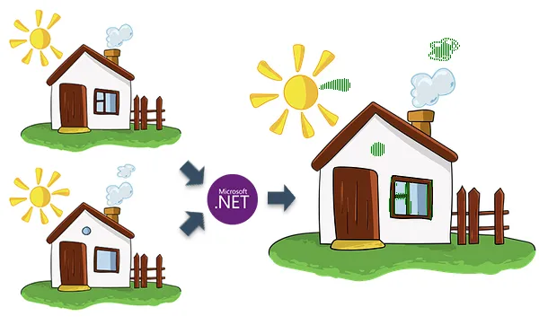

# Aprendiendo Csharp

## Hola gente

Esto es un ejemplo de subir un repertorio de GitHub

+ Aprendi Git
- Cree mi cuenta de GitHub
* Voy a subir mi primer repositorio a GitHub usando mi primeros comandos de Git

